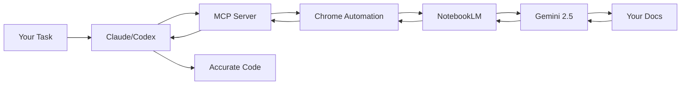

<div align="center">

# NotebookLM MCP Server

**Let your CLI agents (Claude, Cursor, Codex...) chat directly with NotebookLM for zero-hallucination answers based on your own notebooks**

[](https://www.rust-lang.org/)
[](https://modelcontextprotocol.io/)
[](https://github.com/PleasePrompto/notebooklm-skill)
[](https://github.com/PleasePrompto/notebooklm-mcp)

[Why Rust?](#why-rust-the-migration-story) • [Installation](#installation) • [Quick Start](#quick-start) • [Why NotebookLM](#why-notebooklm-not-local-rag) • [Examples](#real-world-example) • [Documentation](./docs/)

</div>

---

> **This is a fork of [PleasePrompto/notebooklm-mcp](https://github.com/PleasePrompto/notebooklm-mcp).**
> The original server was rewritten from TypeScript/Node.js to Rust for significantly lower memory usage, faster startup, and no runtime dependencies. See [Why Rust?](#why-rust-the-migration-story) for the full story.

---

## Why Rust? (The Migration Story)

The original server was written in TypeScript/Node.js. It worked — but the Node.js runtime was fighting against it every step of the way:

- **V8 cold start**: ~1.2 seconds before the first byte of JSON-RPC was processed. Every `npx` invocation paid this tax.
- **120 MB idle RSS**: V8's heap and the MCP SDK loaded ~120 MB just to sit there waiting for a question.
- **GC pauses during streaming**: The streaming detection loop polls the DOM every second for up to 2 minutes — exactly the kind of tight loop where GC pauses cause false "stable" readings. The response text looks unchanged because the GC froze the loop, not because NotebookLM stopped streaming.
- **Single-threaded event loop**: Multiple concurrent sessions shared one JS thread. A slow `ask_question` blocked all other sessions.
- **npm supply chain**: `patchright`, `@modelcontextprotocol/sdk`, `zod`, `globby` — 4 heavyweight runtime dependencies plus their transitive tree, all downloaded fresh on each `npx` run.

The Rust rewrite eliminates all of these at the source:

| Metric | TypeScript/Node.js | Rust |
|--------|-------------------|------|
| Startup time | ~1.2 s | **<100 ms** |
| RSS idle | ~120 MB | **~15 MB** |
| GC pauses | Yes (V8) | **None** |
| Concurrent sessions | Single-threaded event loop | **True OS threads** |
| Runtime dependencies | Node.js + npm | **None** (static binary) |
| Binary size | N/A (needs Node.js) | **~25 MB stripped** |

The streaming detection algorithm, selectors, and all behaviour are identical to the original — only the runtime changed.

---

## The Problem

When you tell Claude Code or Cursor to "search through my local documentation", here's what happens:
- **Massive token consumption**: Searching through documentation means reading multiple files repeatedly
- **Inaccurate retrieval**: Searches for keywords, misses context and connections between docs
- **Hallucinations**: When it can't find something, it invents plausible-sounding APIs
- **Expensive & slow**: Each question requires re-reading multiple files

## The Solution

Let your local agents chat directly with [**NotebookLM**](https://notebooklm.google/) — Google's **zero-hallucination knowledge base** powered by Gemini 2.5 that provides intelligent, synthesized answers from your docs.

```
Your Task → Local Agent asks NotebookLM → Gemini synthesizes answer → Agent writes correct code
```

**The real advantage**: No more manual copy-paste between NotebookLM and your editor. Your agent asks NotebookLM directly and gets answers straight back in the CLI. It builds deep understanding through automatic follow-ups — Claude asks multiple questions in sequence, each building on the last, getting specific implementation details, edge cases, and best practices. You can save NotebookLM links to your local library with tags and descriptions, and Claude automatically selects the relevant notebook based on your current task.

---

## Why NotebookLM, Not Local RAG?

| Approach | Token Cost | Setup Time | Hallucinations | Answer Quality |
|----------|------------|------------|----------------|----------------|
| **Feed docs to Claude** | 🔴 Very high (multiple file reads) | Instant | Yes - fills gaps | Variable retrieval |
| **Web search** | 🟡 Medium | Instant | High - unreliable sources | Hit or miss |
| **Local RAG** | 🟡 Medium-High | Hours (embeddings, chunking) | Medium - retrieval gaps | Depends on setup |
| **NotebookLM MCP** | 🟢 Minimal | 5 minutes | **Zero** - refuses if unknown | Expert synthesis |

### What Makes NotebookLM Superior?

1. **Pre-processed by Gemini**: Upload docs once, get instant expert knowledge
2. **Natural language Q&A**: Not just retrieval — actual understanding and synthesis
3. **Multi-source correlation**: Connects information across 50+ documents
4. **Citation-backed**: Every answer includes source references
5. **No infrastructure**: No vector DBs, embeddings, or chunking strategies needed

---

## Installation

The server is a single Rust binary. Build it once from source:

```bash
git clone https://github.com/PleasePrompto/notebooklm-mcp
cd notebooklm-mcp/rust
cargo build --release
```

The binary is at `rust/target/release/notebooklm-mcp`.

### Claude Code

```bash
claude mcp add notebooklm /path/to/notebooklm-mcp/rust/target/release/notebooklm-mcp
```

### Cursor

Add to `~/.cursor/mcp.json`:
```json
{
  "mcpServers": {
    "notebooklm": {
      "command": "/path/to/notebooklm-mcp/rust/target/release/notebooklm-mcp",
      "args": []
    }
  }
}
```

<details>
<summary>Other MCP clients</summary>

**Generic MCP config:**
```json
{
  "mcpServers": {
    "notebooklm": {
      "command": "/path/to/notebooklm-mcp/rust/target/release/notebooklm-mcp",
      "args": []
    }
  }
}
```
</details>

---

## Alternative: Claude Code Skill

**Prefer Claude Code Skills over MCP?** This server is now also available as a native Claude Code Skill with a simpler setup:

**[NotebookLM Claude Code Skill](https://github.com/PleasePrompto/notebooklm-skill)** - Clone to `~/.claude/skills` and start using immediately

**Key differences:**
- **MCP Server** (this repo): Persistent sessions, works with Claude Code, Codex, Cursor, and other MCP clients
- **Claude Code Skill**: Simpler setup, Python-based, stateless queries, works only with local Claude Code

Both use the same browser automation technology and provide zero-hallucination answers from your NotebookLM notebooks.

---

## Quick Start

### 1. Build and configure the MCP server (see [Installation](#installation) above)

### 2. Authenticate (one-time)

Say in your chat (Claude/Codex):
```
"Log me in to NotebookLM"
```
*A Chrome window opens → log in with Google*

### 3. Create your knowledge base
Go to [notebooklm.google.com](https://notebooklm.google.com) → Create notebook → Upload your docs:
- 📄 PDFs, Google Docs, markdown files
- 🔗 Websites, GitHub repos
- 🎥 YouTube videos
- 📚 Multiple sources per notebook

Share: **⚙️ Share → Anyone with link → Copy**

### 4. Let Claude use it
```
"I'm building with [library]. Here's my NotebookLM: [link]"
```

**That's it.** Claude now asks NotebookLM whatever it needs, building expertise before writing code.

---

## Real-World Example

### Building an n8n Workflow Without Hallucinations

**Challenge**: n8n's API is new — Claude hallucinates node names and functions.

**Solution**:
1. Downloaded complete n8n documentation → merged into manageable chunks
2. Uploaded to NotebookLM
3. Told Claude: *"Build me a Gmail spam filter workflow. Use this NotebookLM: [link]"*

**Watch the AI-to-AI conversation:**

```
Claude → "How does Gmail integration work in n8n?"
NotebookLM → "Use Gmail Trigger with polling, or Gmail node with Get Many..."

Claude → "How to decode base64 email body?"
NotebookLM → "Body is base64url encoded in payload.parts, use Function node..."

Claude → "How to parse OpenAI response as JSON?"
NotebookLM → "Set responseFormat to json, use {{ $json.spam }} in IF node..."

Claude → "What about error handling if the API fails?"
NotebookLM → "Use Error Trigger node with Continue On Fail enabled..."

Claude → ✅ "Here's your complete workflow JSON..."
```

**Result**: Perfect workflow on first try. No debugging hallucinated APIs.

---

## Core Features

### **Zero Hallucinations**
NotebookLM refuses to answer if information isn't in your docs. No invented APIs.

### **Autonomous Research**
Claude asks follow-up questions automatically, building complete understanding before coding.

### **Smart Library Management**
Save NotebookLM links with tags and descriptions. Claude auto-selects the right notebook for your task.
```
"Add [link] to library tagged 'frontend, react, components'"
```

### **Deep, Iterative Research**
- Claude automatically asks follow-up questions to build complete understanding
- Each answer triggers deeper questions until Claude has all the details

### **Cross-Tool Sharing**
Set up once, use everywhere. Claude Code, Codex, Cursor — all share the same library.

### **Minimal Footprint**
Single Rust binary — ~10 MB, <20 MB RSS idle, <100 ms startup. No Node.js, no npm, no runtime dependencies.

---

## Tool Profiles

Reduce token usage by loading only the tools you need. Each tool consumes context tokens — fewer tools = faster responses and lower costs.

### Available Profiles

| Profile | Tools | Use Case |
|---------|-------|----------|
| **minimal** | 5 | Query-only: `ask_question`, `get_health`, `list_notebooks`, `select_notebook`, `get_notebook` |
| **standard** | 10 | + Library management: `setup_auth`, `list_sessions`, `add_notebook`, `update_notebook`, `search_notebooks` |
| **full** | 16 | All tools including `cleanup_data`, `re_auth`, `remove_notebook`, `reset_session`, `close_session`, `get_library_stats` |

### Configure via Environment Variables

```bash
# Set profile
export NOTEBOOKLM_PROFILE=minimal

# Disable specific tools
export NOTEBOOKLM_DISABLED_TOOLS="cleanup_data,re_auth,remove_notebook"
```

Settings are saved to `~/.config/notebooklm-mcp/settings.json` and persist across sessions. Environment variables override file settings.

---

## Architecture



---

## Common Commands

| Intent | Say | Result |
|--------|-----|--------|
| Authenticate | *"Open NotebookLM auth setup"* or *"Log me in to NotebookLM"* | Chrome opens for login |
| Add notebook | *"Add [link] to library"* | Saves notebook with metadata |
| List notebooks | *"Show our notebooks"* | Lists all saved notebooks |
| Research first | *"Research this in NotebookLM before coding"* | Multi-question session |
| Select notebook | *"Use the React notebook"* | Sets active notebook |
| Update notebook | *"Update notebook tags"* | Modify metadata |
| Remove notebook | *"Remove [notebook] from library"* | Deletes from library |
| View browser | *"Show me the browser"* | Watch live NotebookLM chat |
| Fix auth | *"Repair NotebookLM authentication"* | Clears and re-authenticates |
| Switch account | *"Re-authenticate with different Google account"* | Changes account |
| Clean restart | *"Run NotebookLM cleanup"* | Removes all data for fresh start |
| Keep library | *"Cleanup but keep my library"* | Preserves notebooks |
| Delete all data | *"Delete all NotebookLM data"* | Complete removal |

---

## Comparison to Alternatives

### vs. Downloading docs locally
- **You**: Download docs → Claude: "search through these files"
- **Problem**: Claude reads thousands of files → massive token usage, often misses connections
- **NotebookLM**: Pre-indexed by Gemini, semantic understanding across all docs

### vs. Web search
- **You**: "Research X online"
- **Problem**: Outdated info, hallucinated examples, unreliable sources
- **NotebookLM**: Only your trusted docs, always current, with citations

### vs. Local RAG setup
- **You**: Set up embeddings, vector DB, chunking strategy, retrieval pipeline
- **Problem**: Hours of setup, tuning retrieval, still gets "creative" with gaps
- **NotebookLM**: Upload docs → done. Google handles everything.

---

## FAQ

**Is it really zero hallucinations?**
Yes. NotebookLM is specifically designed to only answer from uploaded sources. If it doesn't know, it says so.

**What about rate limits?**
Free tier has daily query limits per Google account. Quick account switching supported for continued research.

**How secure is this?**
Chrome runs locally. Your credentials never leave your machine. Use a dedicated Google account if concerned.

**Can I see what's happening?**
Yes! Say *"Show me the browser"* to watch the live NotebookLM conversation.

**What makes this better than Claude's built-in knowledge?**
Your docs are always current. No training cutoff. No hallucinations. Perfect for new libraries, internal APIs, or fast-moving projects.

---

## Advanced Usage

- 📖 [**Usage Guide**](./docs/usage-guide.md) — Patterns, workflows, tips
- 🛠️ [**Tool Reference**](./docs/tools.md) — Complete MCP API
- 🔧 [**Configuration**](./docs/configuration.md) — Environment variables
- 🐛 [**Troubleshooting**](./docs/troubleshooting.md) — Common issues

---

## The Bottom Line

**Without NotebookLM MCP**: Write code → Find it's wrong → Debug hallucinated APIs → Repeat

**With NotebookLM MCP**: Claude researches first → Writes correct code → Ship faster

Stop debugging hallucinations. Start shipping accurate code.

---

## Disclaimer

This tool automates browser interactions with NotebookLM to make your workflow more efficient. However, a few friendly reminders:

**About browser automation:**
While I've built in humanization features (realistic typing speeds, natural delays, mouse movements) to make the automation behave more naturally, I can't guarantee Google won't detect or flag automated usage. I recommend using a dedicated Google account for automation rather than your primary account—think of it like web scraping: probably fine, but better safe than sorry!

**About CLI tools and AI agents:**
CLI tools like Claude Code, Codex, and similar AI-powered assistants are incredibly powerful, but they can make mistakes. Please use them with care and awareness:
- Always review changes before committing or deploying
- Test in safe environments first
- Keep backups of important work
- Remember: AI agents are assistants, not infallible oracles

I built this tool for myself because I was tired of the copy-paste dance between NotebookLM and my editor. I'm sharing it in the hope it helps others too, but I can't take responsibility for any issues, data loss, or account problems that might occur. Use at your own discretion and judgment.

That said, if you run into problems or have questions, feel free to open an issue on GitHub. I'm happy to help troubleshoot!

---

## Contributing

Found a bug? Have a feature idea? [Open an issue](https://github.com/PleasePrompto/notebooklm-mcp/issues) or submit a PR!

## License

MIT — Use freely in your projects.

---

<div align="center">

Built with frustration about hallucinated APIs, powered by Google's NotebookLM

⭐ [Star on GitHub](https://github.com/PleasePrompto/notebooklm-mcp) if this saves you debugging time!

</div>
